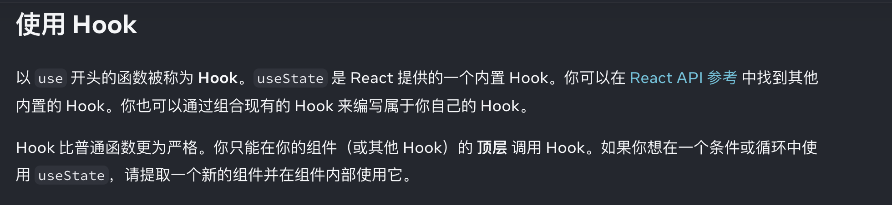
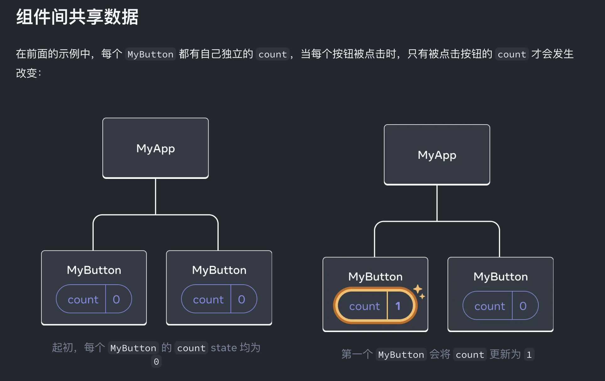
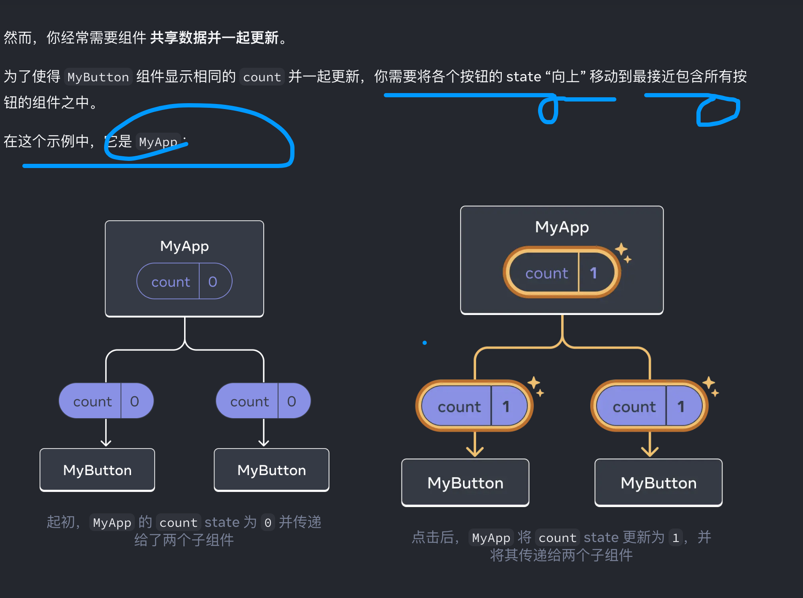

# My_react

## Learn React
[Learn React](https://react.dev/learn)

Greating and nesting components

React apps are made out of components. A component is a piece of  the UI(user
 interface) that has its own logic and appearance. A component can be as 
 small as  a button, or as large as an entire page.


 ##  React components are JavaScript functions that return markup:
 ```
 function MyButton(){
    return(
        <button> This is a button </button>
    );
 }
```
## Use Vite to set up React enviroment.

## Vite set
[Vite Set](https://www.w3schools.com/REACT/react_getstarted.asp)

## React learn map

Create user interfaces from components.

React lets you build user interfaces out of individual pieces called 
components.
Create your own React components like ```Thumbnail``` ```LikeButton```
and ```Video```
Then combine them into entire screens,pages,and apps.

```
function Video({video}){
    return(
        <div>
            <Thumbnail video={video} />
            <a href={video.url}>
                <h3>{video.title}</h3>
                <p>{video.description}</p>
            </a>
            <likeButton video ={video} />
        </div>
    )
}
```

Whether you work on your own or with thousands of other 
developers, using React feels the same.
It is designed to let your seamlessly combine components
written by independent people, teams, and organizations.

## Write components with code and markup
[react](https://react.dev/)

React components are JavaScript functions. Want to show some 
content conditionally? Use an ```if``` statement. Displaying a 
list? Try array ```map()```. Learning React is learning programming.

## This markup syntax is called JSX. It is a JavaScript syntax 

extension popularized by React. Putting JSX markup close to realated 
rendering logic makes React components easy to create, maintain, and 
delete.
## Quick Start
[Quick Start](https://react.dev/learn)

## Writing markup with JSX
[markup with JSX](https://react.dev/learn)

JSX is stricter than HTML. You have to close tags like ```<br />```. Your component also
can't return multiple JSX tags. You have to wrap them into a shared
parent, like a```<div> ...</div>```or an empty``` <>...</>```

## Transform HTML to JSX
[Transform](https://transform.tools/html-to-jsx)
## React does not prescribe how your add CSS files.
In the simplest case, you'll add a ```<link>```tag to 
your HTML. If you use a build tool or a framework, consult
its documentation to learn how to add a CSS file to your  project.

## Displaying data
JSX lets you put markup into JavaScript. Curly braces let you "escape back"
into JavaScript so that you can embed some variable from your
code and display it to the user. For example, this will display
```user.name:```
```
return(
    <h1>
    {user.name}
    </h1>
)

You can also "escape into JavaScript" from JSX attributes, but you 
have to use curly braces ***instead of *** quotes.
For example, ```className="avatar"``` passed the "avatar" string
 as the CSS class, but ```src={user.imageUrl} reads the **JavaScript**
 ```user.imageUrl``` variable value, and then passes that value
 as the ```src``` attribute:

```
return(
    
)

## Conditional Render

In React, there is no special syntax for writing conditions. Instead , you'll use the 
the same techniques as you use when writing regular
JavaScript code. For example, you can use an ```if```
statement to conditionally include JSX:

```
let content;

if(isLoggedIn){
    content=<AdminPannel />;
}else{
    content=<LoginForm />;
}

return(
    <div>
    {content}
    </div>
);
````
If you prefer more compact code, you can use the ```conditional ?operator```
Unlike ```if```, it works inside JSX :
```
<div>
{isLoggedIn ?(
    <AdminPanel />
):(
    <LoginForm />
)}
</div>
```

When you don't need the ```else ``` branch, 
you can also use a shorter ```logical && syntax```

```
<div>
{isLoggedIn} &&{AdminPanel />}
</div>
```

你提供的這段 JSX 代碼：

```jsx
<div>
  {isLoggedIn && <AdminPanel />}
</div>
```

這是 React 中非常常見的一種**條件渲染**寫法。讓我一步步詳細解釋它的含義和原理。

### 整體含義
這段代碼的意思是：

**只有當 `isLoggedIn` 為 true 時，才渲染 `<AdminPanel />` 組件；否則什麼都不渲染。**

簡單來說：用戶登錄了 → 顯示管理面板；沒登錄 → 什麼都不顯示。

### 為什麼可以用 `&&` 來做條件渲染？
這是因為 JavaScript 的**邏輯與運算符 `&&`** 的短路特性：

- `expr1 && expr2` 的規則：
  - 如果 `expr1` 是 **falsy** 值（false、null、undefined、0、''、NaN），則直接返回 `expr1`，**不計算 expr2**。
  - 如果 `expr1` 是 **truthy** 值（true、物件、字串、數字等），則返回 `expr2`。

在 JSX 中，React 會自動忽略 falsy 值（除了 `0` 以外），不會渲染它們。

### 具體執行過程舉例

假設有以下情況：

1. **用戶已登錄**：
   ```js
   const isLoggedIn = true;
   ```
   → `true && <AdminPanel />`  
   → 因為左邊是 true，所以返回右邊的 `<AdminPanel />`  
   → React 渲染出管理面板

2. **用戶未登錄**：
   ```js
   const isLoggedIn = false;
   ```
   → `false && <AdminPanel />`  
   → 因為左邊是 false，直接返回 false（短路），不看右邊  
   → React 收到 false，不渲染任何東西（div 裡是空的）

3. **其他 falsy 值**（如 undefined 或 null）：
   ```js
   const isLoggedIn = null;
   ```
   → 同樣不會渲染 `<AdminPanel />`

### 完整範例

```jsx
function Dashboard() {
  const isLoggedIn = true;  // 或 false，根據實際登入狀態

  return (
    <div>
      <h1>歡迎來到後台</h1>
      
      {/* 只有登入才顯示管理面板 */}
      {isLoggedIn && <AdminPanel />}
      
      {/* 你也可以寫得更明顯 */}
      {/* {isLoggedIn ? <AdminPanel /> : null} */}
    </div>
  );
}
```

### 注意事項

- 這種寫法等價於三元運算符：
  ```jsx
  {isLoggedIn ? <AdminPanel /> : null}
  ```
  或
  ```jsx
  {isLoggedIn ? <AdminPanel /> : <></>}
  ```
  很多人用 `&&` 是因為它更簡潔，尤其當「不渲染任何東西」時。

- 如果 `isLoggedIn` 是 `0`，React 會渲染出數字 0（特殊情況），所以要小心。但通常登入狀態是 boolean，所以沒問題。

### 總結

```jsx
{isLoggedIn && <AdminPanel />}
```

這行代碼是 React 中優雅的條件渲染技巧：

- 簡潔、清晰、可讀性高  
- 常用於：權限控制、登入後才顯示的內容、選項功能等

你現在經常會在 React 專案中看到這種寫法！如果想練習，可以試著改成用三元運算符寫一遍，效果完全一樣。

All of these approaches also work for conditonally
specifying attributes. If you're unfamiliar with some 
of this JavaScript syntax, you can start by always using 
``` if...else```.
## Rendering lists

You will rely on JavaScript features like ```for ```
```loop``` and the ```array map() function``` to render
lists of components.

For example, let's say you have an array of products:
```
const products=[
    {title:'tesla',id:1},
    {title:'toyota',id:2},
    {title:'BWM',id3},
];
```
Inside your component, use the ```map()``` function to transform an array of 
products into an array of ```<li>``` items:
```
const listItems =products.map(product =>
<li key={product.id}>

{products.title}
</li>);

return(

    <ul>{listItems}</ul>
);

```
## Notice <li> Key id
Notice how ```<li>``` has a ```key``` attribute. For each item
in a list, you should pass a string or a number that uniquely
identifies that item among its siblings. Usually, a key should
be coming from your data, such as a database ID. React uses your
keys to know what happened if your later insert, delete, or reorder
the items.

## Responding to events

You can respond to events by declaring **handler functions** inside your components:

## Notice how ```onClick={handleClick}```
has no parentheses at the end!
Do not call the event handler function: you only need to 
***pass*** it down. React will call your event handler when 
the user clicks the button.

## Updating the screen

Often, you'll want your component to "remember" some information 
and display it. For example, maybe you want to count the number
of times a button is clicked.To do this, add **state** to your 
component.

First, import ```useState``` from React:

```import {useState} from 'react'```;

Now you can declare a ***state*** variable inside your component:

```
function MyButton(){
    const [count,setCount] =useState(0);
}
```
You'll get two things from ```useState```: the current state ```count```,
and the function  that lets you update it ```(setCount)```.
You can give them any names, but the convention is to write
``` [something, setSomething].```

##
The first time the button is displayed, ```count``` will be 
```0``` because you passed ```0``` to ```useState()```. When
you want to change state, call ```setCount()``` and pass
the new value to it. Clicking this button will increment the 
counter:

## Using Hooks
Functions starting with ```use``` are called ```Hooks```.
```useState``` is a built-in hook provided by 
React. You can find other built-in 
Hooks in the ```API reference```
You can also write your own Hooks by combining the existing ones.
## Hooks are more ```restrictive``` 
than other funcitons. You can only Hooks *** at the top of ```
your components (or other Hooks). if your want to use ```useState```
in a condition or a loop , 






